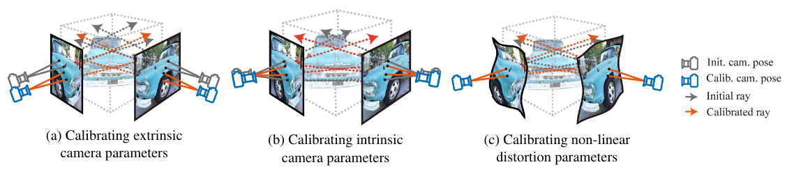
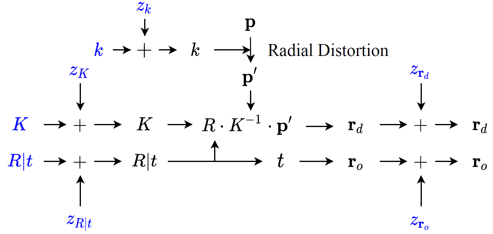
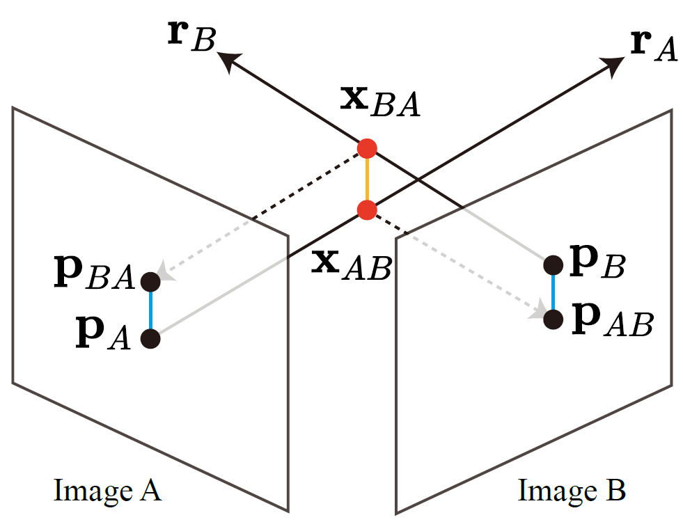
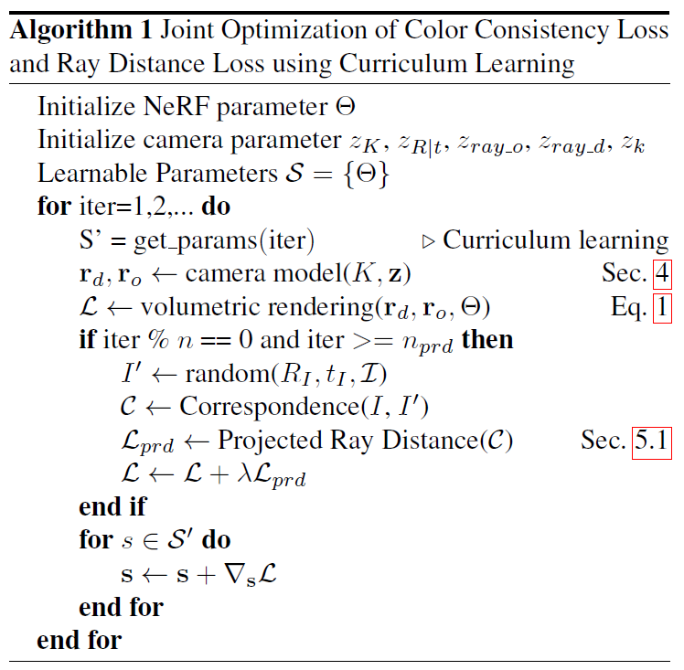

# Self-Calibrating Neural Radiance Fields, ICCV, 2021

[Project Page](https://postech-cvlab.github.io/SCNeRF/) | [Paper](https://arxiv.org/abs/2108.13826) | [Video](https://www.youtube.com/watch?v=wsjx6geduvk)

## Author Information

- [Yoonwoo Jeong](https://yoonwooinfo.notion.site) [[Google Scholar]](https://scholar.google.com/citations?user=HQ1PMggAAAAJ&hl=en)
- Seokjun Ahn [[Google Scholar]](https://scholar.google.com/citations?user=JDEvLgwAAAAJ&hl=en)
- [Chris Choy](https://chrischoy.org) [[Google Scholar]](https://scholar.google.com/citations?user=2u8G5ksAAAAJ&hl=en&oi=ao)
- [Anima Anandkumar](http://tensorlab.cms.caltech.edu/users/anima/) [[Google Scholar]](https://scholar.google.com/citations?user=bEcLezcAAAAJ&hl=en&oi=ao)
- [Minsu Cho](http://cvlab.postech.ac.kr/~mcho/) [[Google Scholar]](https://scholar.google.com/citations?user=5TyoF5QAAAAJ&hl=en&oi=ao)
- [Jaesik Park](http://jaesik.info/) [[Google Scholar]](https://scholar.google.com/citations?user=_3q6KBIAAAAJ&hl=en&oi=ao)

<div style="text-align:center">

</div>

## News

- 2021-09-02: The first version of Self-Calibrating Neural Radiance Fields is published

## Overview

In this work, we propose a camera self-calibration algorithm for generic cameras with arbitrary non-linear distortions. We jointly learn the geometry of the scene and the accurate camera parameters without any calibration objects. Our camera model consists a pinhole model, radial distortion, and a generic noise model that can learn arbitrary non-linear camera distortions. While traditional self-calibration algorithms mostly rely on geometric constraints, we additionally incorporate photometric consistency. This requires learning the geometry of the scene and we use Neural Radiance Fields (NeRF).
We also propose a new geometric loss function, viz., projected ray distance loss, to incorporate geometric consistency for complex non-linear camera models. We validate our approach on standard real image datasets and demonstrate our model can learn the camera intrinsics and extrinsics (pose) from scratch without COLMAP initialization. Also, we show that learning accurate camera models in differentiable manner allows us to improves PSNR over NeRF. We experimentally demonstrate that our proposed method is applicable to variants of NeRF. In addition, we use a set of images captured with a fish-eye lens to demonstrate that learning camera model jointly improves the performance significantly over the COLMAP initialization.

## Method

### Generic Camera Model

We provide the definition of our differentiable camera model that combines the pinhole camera model, radial distortion, and a generic non-linear camera distortion for self-calibration. Our differentiable generic camera model consists of four components: intrinsic, extrinsic, radial distortion, and non-linear distortion parameters. We show that modeling the rays more accurately (camera model) results in better neural rendering. The following figure shows the computational steps to generate rays of our proposed learnable generic camera model.

<p align="center">

</p>


### Projected Ray Distance

The generic camera model poses a new challenge defining a geometric loss. In most traditional work, the geometric loss is defined as an epipolar constraint that measures the distance between an epipolar line and the corresponding point, or reprojection error where a 3D point for a correspondence is defined first which is then projected to an image plane to measure the distance between the projection and the correspondence. In this work, rather than requiring a 3D reconstruction to compute an indirect loss like the reprojection error, we propose the projected ray distance loss that directly measures the discrepancy between rays using our generic camera model.

<p align="center">

</p>

### Curriculum Learning

The camera parameters determine the positions and directions of the rays for NeRF learning, and unstable values often result in divergence or sub-optimal results. Thus, we incrementally add a subset of learning parameters to the optimization process to reduce the complexity of learning cameras and geometry jointly. First, we learn the NeRF network while initializing the camera focal lengths and camera centers to half the image width and height. Learning coarse geometry first is crucial since it initializes the network parameters suitable for learning better camera parameters. Next, we sequentially add camera parameters from the linear camera model, radial distortion, to nonlinear noise of ray direction, ray origin to the learning. We progressively make the camera model more complex to prevent the camera parameters from overfitting and also allows faster training.


<p align="center">

</p>


## Installation

### Requirements

- Ubuntu 16.04 or higher
- CUDA 11.1 or higher
- Python v3.7 or higher
- Pytorch v1.7 or higher
- Hardware Spec
    - GPUs 11GB (2080ti) or larger capacity
    - For NeRF++, 2GPUs(2080ti) are required to reproduce the result
    - For FishEyeNeRF experiments, we have used 4GPUs(V100). 

### Environment Setup

- We recommend to conda for installation. All the requirements for two codes, NeRF and NeRF++, are included in the requirements.txt

    ```
    conda create -n icn python=3.8
    conda activate icn
    pip install -r requirements.txt
    git submodule update --init --recursive
    ```


### Generating COLMAP poses of custom image set

- We further provide a COLMAP pose generator that can be applied to custom image sets. Run the code below if you should acquire camera information for custome image sets. 
```
bash colmap_utils/colmap.sh [path to image set]
```
The image collection should be inside the directory "images." Checkout the COLMAP document
```
[path]
    |--- images
```


## Pretrained Weights & Qualitative Results

Here, we provide pretrained weights for users to easily reproduce results in the paper. You can download the pretrained weight in the following link. In the link, we provide all the weights of experiments, reported in our paper. To load the pretrained weight, add the following argument at the end of argument in each script. In the zip file, we have also included qualitative results that are used in our paper.

Link to download the pretrained weight: [[link]](https://drive.google.com/file/d/13TjJUnRPA5UjTfsTBkx18GGXeYEqxTJf/view?usp=sharing)


## Datasets

We use three datasets for evaluation: LLFF dataset, tanks and temples dataset, and FishEyeNeRF dataset (Images captured with a fish-eye lens).
- LLFF dataset: [[link]](https://drive.google.com/drive/folders/128yBriW1IG_3NJ5Rp7APSTZsJqdJdfc1)
- Tanks and Temples dataset: [[link]](https://drive.google.com/file/d/11KRfN91W1AxAW6lOFs4EeYDbeoQZCi87/view?usp=sharing)
- FishEyeNeRF: [[link]](https://drive.google.com/file/d/1VhnpMUIKEak4TBpKY4H8vMJJe--FM2k5/view?usp=sharing)

Put the data in the directory "data/" then add soft link with one of the following:

```
ln -s data NeRF/data
ln -s data nerfplusplus/data
ln -s data nerfplusplus/data/fisheyenerf
```

## Demo Code

The demo code is available at "demo.sh" file. This code runs curriculum learning in NeRF architecture. Please install the aforementioned requirements before running the code. To run the demo code, run:

```
sh demo.sh
```

If you want to reproduce the results that are reported in our main paper, run the scripts in the "scripts" directory.

```
Main Table 1: Self-Calibration Experiment (LLFF)
Main Table 2: Improvement over NeRF (LLFF)
Main Table 3: Improvement over NeRF++ (Tanks and Temples)
Main Table 4: Improvement over NeRF++ (Images with a fish-eye lens)
```

Code Example:

```
sh scripts/main_table_1/fern/main1_fern_ours.sh
sh scripts/main_table_2/fern/main2_fern_ours.sh
sh scripts/main_table_3/main3_m60.sh
sh scripts/main_table_4/globe_ours.sh
```

## Citing Self-Calibrating Neural Radiance Fields

```
@inproceedings{SCNeRF2021,
    author = {Yoonwoo Jeong, Seokjun Ahn, Christopher Choy, Animashree Anandkumar, 
    Minsu Cho, and Jaesik Park},
    title = {Self-Calibrating Neural Radiance Fields},
    booktitle = {ICCV},
    year = {2021},
}
```

## Concurrent Work

We list a few recent concurrent projects that tackle camera extrinsics (pose) optimization in NeRF. Note that our Self-Calibrating NeRF optimizes an extensive set of camera parameters for intrinsics, extrinsics, radial distortion, and non-linear distortion.

- [NeRF--: Neural Radiance Fields Without Known Camera Parameters](https://arxiv.org/abs/2102.07064)
- [BARF: Bundle-Adjusting Neural Radiance Fields](https://arxiv.org/abs/2104.06405)


## Acknowledgements

We appreciate all ICCV reviewers for valuable comments. Their valuable suggestions have helped us to improve our paper.
We also acknowledge amazing implementations of NeRF++(https://github.com/Kai-46/nerfplusplus) and NeRF-pytorch(https://github.com/yenchenlin/nerf-pytorch).
